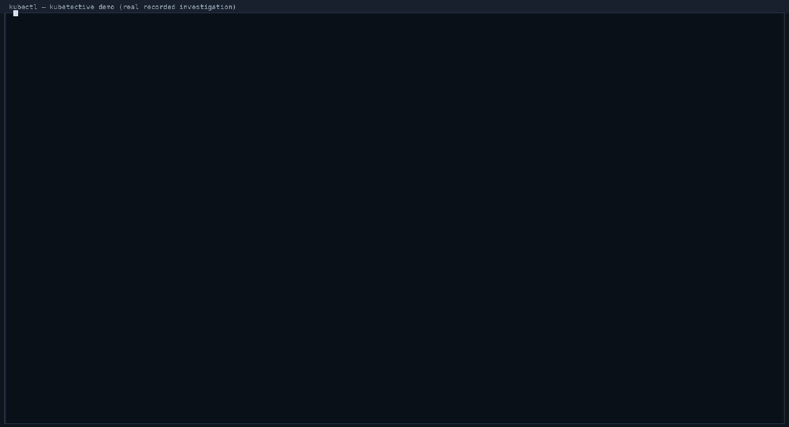

# KubeTective: Kubernetes Incident Investigation Engine

KubeTective investigates Kubernetes incidents the way a good SRE would. It collects
facts about the target, builds a timeline and an evidence graph, generates ranked
hypotheses with explainable, deterministic scores, and shows you exactly why it
thinks what it thinks. Every point of confidence is backed by a visible list of
evidence.

It runs as a CLI, a `kubectl` plugin, a REST server, or an MCP server. Every
investigation is recorded so it can be replayed, audited, and used as a benchmark.

Docs: [gledilami.github.io/kubetective](https://gledilami.github.io/kubetective/) · [Changelog](CHANGELOG.md) · [Contributing](CONTRIBUTING.md)



*The demo above is a replay of a recorded incident
required.*

## What it finds in 30 seconds

`kubectl investigate <target> --since=30m` turns an "everything looks fine?"
moment into a ranked verdict with evidence (the GIF above is the full
output; this is the 5-second version):

```sh
$ kubectl investigate deployment/checkout --since=30m
╭──────────────────────────────────────────────────╮
│ INCIDENT: deployment/prod/checkout                 │
│ Status: OOMKILLED                                   │
│ Severity: HIGH                                       │
│ Confidence: 100                                      │
╰──────────────────────────────────────────────────╯

ROOT CAUSE
  Memory exhaustion: container terminated with OOMKilled 19 time(s) (memory limit 1Gi) - 19 restart(s)

RECOMMENDATION
  roll back deployment/prod/checkout to the last known-good revision [MEDIUM]
```

That output is the recorded incident `scenarios/oom-after-deploy` replayed
through the engine. 11 analyzers cover OOM kills, crash loops, image pull
failures, scheduling failures, node pressure, probe failures, PVC issues,
service selector mismatches, HPA at max, DNS failures, and configuration
regressions (Git/GitOps, down to the commit).

## Try it in 5 minutes, no broken cluster needed

```sh
git clone https://github.com/GlediLami/kubetective.git && cd kubetective
make build
bin/kubetective replay scenarios/oom-after-deploy/record.jsonl   # a real incident, replayed
bin/kubetective benchmark                                        # 16 scenarios vs. ground truth
bin/kubetective evaluate                                         # markdown accuracy report
```

Every recorded incident in `scenarios/` is a self-contained, deterministic demo
and doubles as the regression gate for every analyzer.

## KubeTective vs. the status quo

| | `kubectl` + grep + docs | LLM chat | KubeTective |
|---|---|---|---|
| Collects and correlates the facts | ✗ you dig | ✗ you paste | ✓ automatic (k8s, Prometheus, Loki, Git/GitOps) |
| Ranked hypotheses with confidence | ✗ | ~ vibes | ✓ calibrated against ground truth |
| Every verdict shows its evidence | ✗ | rarely | ✓ line-by-line score breakdown |
| Verifiable with a recorded replay | ✗ | ✗ | ✓ JSONL records, re-run deterministically |
| Change detection (what changed right before) | ✗ | ✗ | ✓ git commits, GitOps drift, pod changes |
| Regression-tested on a scenario suite | ✗ | ✗ | ✓ `kubetective benchmark` in CI |
| Safe remediation with approval | ✗ | ✗ | ✓ read-only preview → explicit `--yes` |
| Safe remediation with approval | ✗ | ✗ | ✓ read-only preview → explicit `--yes` |
| Works offline, no API key, no telemetry | ✓ | ✗ | ✓ |

## An honest note on AI triage tools (k8sgpt etc.)

There is a popular class of "AI kubectl" tools that scan the cluster and
explain failures with an LLM. They are genuinely useful for triage — but
the core difference is what kind of artifact they produce:

| | AI triage (e.g. k8sgpt) | KubeTective |
|---|---|---|
| Question it answers | "what might be wrong here?" | "what is wrong — how sure, and which commit did it?" |
| Verdict source | LLM interpretation | evidence-scored rule engine |
| Same incident twice | different prose | identical verdict (CI-reproducible) |
| Calibrated confidence | ✗ | ✓ against 16 ground-truth scenarios, leave-one-out |
| Shows the reasoning | prose summary | every score as a readable evidence term |
| Points at a git change | ✗ scans current state | ✓ git/GitOps commit correlation |
| Needs an AI backend | `--explain` does; scan output stays unranked prose | **no** — verdicts require no AI; the explainer is optional |
| What leaves your machine | anonymized payloads; event messages currently unmasked | only a redacted digest — never raw logs, events, or secrets |
| Regression-tested against real incidents | ✗ | ✓ `kubetective benchmark` is the merge gate |
| Can undo / plan the fix with a trail | ✗ (text suggestions) | ✓ read-only preview → approved apply → audit record |

Where they shine and we don't (yet): cluster-wide scanning, a bigger analyzer
catalog, LLM backend breadth, and an operator for continuous monitoring —
all on our roadmap, all reproducible from our side.

## Why deterministic first?

KubeTective's verdicts come from a rule-based engine, not an LLM. Each hypothesis
score is a sum of weighted evidence terms you can read line by line. Confidence is
calibrated against a scenario benchmark (16 recorded incidents with ground truth),
and the calibration is validated leave-one-out before it is adopted. The optional
LLM layer only explains the engine's verdict in plain language. It can never change
scores, invent causes, or propose actions. Deterministic output means the same
incident produces the same verdict in CI, in a demo, and in a replay an LLM chat
cannot be a regression test.

## Features

- **Evidence-based investigation.** 11 analyzers cover the most common failure
  modes: OOM kills, crash loops, image pull failures, scheduling and
  unschedulable pods, node pressure, liveness and readiness probe failures, PVC
  issues, service selector mismatches, HPA at max, DNS failures, and configuration
  regressions (Git and GitOps).
- **Collectors.** Kubernetes (pods, deployments, events, PVCs, services, HPAs,
  coreDNS), Prometheus (memory-metric corroboration), Git (commits touching your
  manifests), and GitOps (Flux `Kustomization`/`HelmRelease`, ArgoCD `Application`).
- **Explainable scoring.** Every hypothesis ships its evidence breakdown, and
  scores are calibrated against the scenario suite with leave-one-out validation.
- **Timeline, evidence graph, and change detection.** What happened, in what order,
  what owns what, and what changed right before the incident.
- **Record and replay.** Every investigation is appended to
  `~/.kubetective/incidents/` as JSONL. Replay it, diff engine versions, audit it.
- **Scenario benchmark and evaluation report.** `kubetective benchmark` is the
  regression gate for every analyzer. `kubetective evaluate` renders a markdown
  evaluation report (per-scenario, per-category accuracy, calibration,
  false-positive check) suitable for CI.
- **Safe remediation.** Actions (rollback, restart) are previewed read-only and
  applied only after explicit human approval. Every apply writes an audit record.
- **REST server and MCP server.** The same pipeline behind an HTTP API and an MCP
  stdio server with read-only tools.
- **Optional LLM explainer.** Digest-only, redacted, constrained. Works with any
  OpenAI-compatible endpoint (OpenAI, Ollama, vLLM, llama.cpp).
- **kubectl plugin.** Drop the binary named `kubectl-investigate` on your `PATH`
  and run `kubectl investigate <resource>`.

## Good first contributions

- **Add a scenario.** Record a new incident with `kubetective record --from-live`,
  add ground truth, and it becomes both a demo and a benchmark case.
- **Harden an analyzer.** Pick one of the 11 analyzers, find a false positive
  against the suite, fix the scoring, and let `kubetective benchmark` prove it.
- **Improve the output.** The renderer is plain-ANSI box drawing; new output
  formats (`--format=json` exists; a `sarif` or `slack` renderer is open).
- **Wire a new evidence source** (e.g. Datadog, Grafana Cloud) behind the existing
  collector interface.

See [CONTRIBUTING.md](CONTRIBUTING.md) for the design rules.

## Install

### Homebrew

```sh
brew install gledilami/kubetective/kubetective
```

This installs both binaries: `kubetective` and `kubectl-investigate` (the kubectl
plugin). Homebrew finds the formula in the `homebrew-kubetective` tap automatically,
no extra steps.

### Go

```sh
go install github.com/GlediLami/kubetective/cmd/kubetective@latest
```

### From source

Requires Go 1.26 or newer and a Kubernetes cluster (for live investigations; the
benchmark runs without one).

```sh
git clone https://github.com/GlediLami/kubetective.git
cd kubetective
make build            # bin/kubetective + bin/kubectl-investigate
make install          # kubetective -> ~/.local/bin/kubetective
make install-plugin   # kubectl-investigate -> ~/.local/bin (kubectl plugin)
```

Point `PREFIX=/usr/local` at `make install` to install system-wide.

### kubectl plugin

kubectl auto-discovers plugins named `kubectl-*` on `PATH`:

```sh
make install-plugin
kubectl investigate pod/checkout-7f84c9   # same as: kubetective investigate ...
```

## Quick start

Investigate a crash-looping deployment (uses your current kubeconfig context):

```sh
kubectl investigate deployment/checkout --since=30m
# or without the plugin:
kubetective investigate deployment/checkout --since=30m
```

Target forms: `pod/<name>`, `deployment/<name>`, `namespace/<name>` (or a bare
name, which defaults to a pod), optionally scoped with `--namespace` and a window
(`--since=2h`, default 30m).

Optional evidence sources:

```sh
kubetective investigate deployment/checkout \
  --since=30m \
  --prometheus-url=http://localhost:9090 \   # metric corroboration
  --loki-url=http://localhost:3100 \         # log evidence (Loki)
  --git-repo=~/code/checkout-manifests       # commits touching your manifests
```

## Command reference

| Command | Description |
|---|---|
| `kubetective investigate <resource>` | Run an investigation (flags: `--since`, `--namespace`, `--no-logs`, `--format=json`, `--prometheus-url`, `--loki-url`, `--git-repo`, `--llm*`) |
| `kubetective replay <incident-id>` | Re-run a recorded investigation through the current engine (deterministic) |
| `kubetective incidents` | List recorded incident ids, newest first |
| `kubetective incidents similar <id> [--cluster <id>]` | Find similar past incidents (incident memory, Jaccard overlap; `--cluster` scopes the lookup to one cluster) |
| `kubetective alert <pagerduty\|grafana\|slack>` | Investigate from a webhook alert payload (stdin or `--file`; zero API keys) |
| `kubetective doctor` | Health check (version, config file, calibration, cluster connectivity, incident store, Prometheus/Loki reachability); exits non-zero on any failure |
| `kubetective action <incident-id>` | Preview remediation actions (read-only; `--apply <id> --yes` to execute with approval) |
| `kubetective benchmark [suite]` | Run the scenario suite gate. Exits 1 on any regression |
| `kubetective evaluate [suite]` | Markdown evaluation report (per-category accuracy, calibration, FP check) |
| `kubetective serve --listen :8080` | REST API server |
| `kubetective mcp` | MCP server over stdio (read-only tools) |
| `kubetective version` | Print the engine version |

Run `kubetective <command> --help` for every flag.

## Configuration

KubeTective reads kubeconfig the same way kubectl does (`--kubeconfig`, `--context`,
or the default loading rules).

`kubetective.yaml` in the state directory (`~/.kubetective/kubetective.yaml`) sets
defaults for an investigation. Example:

```yaml
# ~/.kubetective/kubetective.yaml
context: prod-eu
namespace: payments
since: 30m
kubeconfig: ~/.kube/config
prometheus_url: http://localhost:9090
loki_url: http://localhost:3100
git_repo: ~/code/payments-manifests
cluster_id: prod-eu # optional: override the auto-derived cluster identity
# webhook_url: https://ops.example.com/kubetective-hook   # opt-in completion notification
# webhook_secret: s3cret                                # HMAC key for the notification signature
llm:
  provider: openai      # or ollama, vllm, llama.cpp
  model: gpt-4o-mini
  base_url: https://api.openai.com/v1
  api_key: sk-...       # or rely on KUBETECTIVE_LLM_API_KEY

# Per-context overrides: when --context (or KUBETECTIVE_CONTEXT) selects
# one of these, the profile merges onto the top-level defaults field by
# field. Everything above is the fallback for any other context.
clusters:
  staging:
    namespace: staging
    loki_url: http://staging-loki:3100
  drone-eu:
    context: drone-eu
    kubeconfig: ~/.kube/corp
    namespace: drone
    cluster_id: drone-eu
```

Precedence is CLI flag > environment variable > per-context profile
> top-level `kubetective.yaml` > default.

| Environment variable | Purpose |
|---|---|
| `KUBETECTIVE_PROMETHEUS` | Prometheus base URL for metric evidence (same as `--prometheus-url`) |
| `KUBETECTIVE_LOKI_URL` | Grafana Loki base URL for log evidence (same as `--loki-url`) |
| `KUBETECTIVE_GIT_REPO` | Path to the manifests git checkout (same as `--git-repo`) |
| `KUBETECTIVE_CONTEXT` | kubeconfig context to target (same as `--context`) |
| `KUBETECTIVE_CLUSTER_ID` | Override the incident-memory cluster id (default: sha256 of the API server host) |
| `KUBETECTIVE_LLM_MODEL` | LLM model name for the explainer |
| `KUBETECTIVE_LLM_BASE_URL` | OpenAI-compatible API base URL (default `https://api.openai.com/v1`) |
| `KUBETECTIVE_LLM_API_KEY` | API key (local servers like Ollama don't need one) |
| `KUBETECTIVE_WEBHOOK_URL` | POST a signed completion notification after every investigation (opt-in) |
| `KUBETECTIVE_WEBHOOK_SECRET` | Shared HMAC secret; the webhook body is signed with it (verify on the receiver side) |
| `KUBETECTIVE_LOG_FORMAT` | Structured logs to stderr: `json` or `text` (off unless set; same as `--log-format`) |
| `KUBETECTIVE_LOG_LEVEL` | Log level: `debug`, `info`, `warn` (default `info`) |
| `KUBETECTIVE_HOME` | State directory (default `~/.kubetective`: incidents, config) |
| `KUBETECTIVE_CONFIG` | Config file path (default `~/.kubetective/config.json`) |

Run `kubetective doctor` to check the whole wiring: engine version, config file,
calibration state, cluster connectivity, incident store, and Prometheus/Loki
reachability. It exits non-zero if anything fails, so it works in CI.

The calibrated scoring temperature is persisted to `~/.kubetective/config.json` by
`benchmark`/`evaluate` and loaded by every invocation.

## Alert integrations (inbound)

Point a PagerDuty/Grafana/Slack webhook at `kubetective alert` and every alert
becomes an investigation with **zero API keys**: the payload is parsed locally,
the engine uses its existing cluster access, and the opt-in completion webhook
reports the result back out.

```sh
# Grafana alert webhook (body from the alert, e.g. a captured POST body):
kubetective alert grafana --file=alert.json --format=json

# PagerDuty v2 webhook:
echo '{...}' | kubetective alert pagerduty

# Slack slash-command payload:
echo '{"text":"deployment/checkout since=2h"}' | kubetective alert slack
```

The target is extracted from the payload: Grafana `kubernetes_pod_name` /
`kubernetes_namespace_name` alert labels (also `pod`, `deployment`, `namespace`;
legacy `evalMatches` and unified `alerts[].labels` shapes), PagerDuty incident
titles carrying a resource name (plus `impacted_services`/`service.summary` and
Events API v2 `details` fields), and Slack command text (`deployment/checkout
since=2h`, the `since=` window is honored). Payloads without a Kubernetes target
fail with a readable message instead of guessing. Window precedence:
`--since` flag > payload > `kubetective.yaml` > 30m.

## How it works

```
kubectl investigate deployment/checkout
        │
        ▼
┌─────────────┐   ┌────────────────┐   ┌──────────────────┐
│  Collect    │──▶│  Build         │──▶│  Analyze         │
│  (k8s, prom,│   │  timeline,     │   │  (11 rule-based  │
│  git, gitops│   │  evidence      │   │  analyzers)      │
│  (staged)   │   │  graph, changes│   │                  │
└─────────────┘   └────────────────┘   └────────┬─────────┘
                                                ▼
┌─────────────────┐   ┌──────────────────────────────────────┐
│  Record +       │◀──│  Score (weighted evidence -> margin → │
│  replay JSONL   │   │  calibrated confidence) + hypothesis  │
│  ~/.kubetective/│   │  engine (merge, rerank, outrank)      │
└─────────────────┘   └──────────────────────────────────────┘
```

1. **Collect.** Observations are normalized facts (`pod.state`, `container.waiting`,
   `event.recorded`, `git.commit`, ...). Nothing raw (log lines, secrets,
   annotations) crosses this boundary.
2. **Build.** The timeline anchors every observation in time. The evidence graph
   links resources (owns, runs-on, changed-before). The change detector answers
   "what changed?".
3. **Analyze.** Each analyzer activates on its observations and emits evidence with
   explicit weights (e.g. `+30` for a CrashLoopBackOff state).
4. **Score.** Margin = Σ weight·strength − gap penalties. Confidence = sigmoid
   (margin / T), where T is calibrated against the scenario suite and validated
   leave-one-out. Every score carries its line-by-line breakdown.
5. **Record.** The full investigation is appended to the incident store.

Confidence calibration and the causality discipline (no `CAUSED_BY` claims without
mechanism, direction, and exclusivity) keep the output honest by construction.

## Safety model

- **Read-only by default.** Investigation never mutates the cluster.
- **Remediation is gated.** `kubetective action <incident-id>` only previews
  (`kubectl rollout undo ... --dry-run=client` equivalents). Applying requires
  `--apply <id> --yes`, an explicit human approval, and appends an audit record
  with user, timestamp, evidence, risk, and result to the incident file.
- **LLM is optional and constrained.** The model receives only a redacted digest
  (no logs, no payload values, no kubeconfig). Its output is validated strict JSON,
  and it cannot change scores or propose actions. Unreachable models degrade
  gracefully; the deterministic verdict always stands.
- **No secrets leave the machine.** The digest boundary is regression-tested.

## REST server

```sh
kubetective serve --listen :8080
```

| Endpoint | Description |
|---|---|
| `POST /v1/investigate` | Run an investigation; body: `{"target":"deployment/checkout","namespace":"prod","since_minutes":30}` |
| `GET /v1/incidents` | List recorded incident ids |
| `GET /v1/incidents/{id}` | Full incident record |
| `GET /incidents/{id}` | Read-only web page for an incident |
| `GET /` | Read-only web UI (incident list) |
| `GET /metrics` | Self-telemetry (expvar counters) |
| `GET /healthz` | Liveness |

## MCP server

```sh
kubetective mcp   # JSON-RPC 2.0 over stdio
```

Tools: `investigate`, `replay`, `list_incidents`, `read_incident`,
`action_preview`. All read-only. There is deliberately no apply tool; remediation
stays human-gated in the CLI.

## LLM explainer

```sh
# OpenAI (or any compatible endpoint: Ollama, vLLM, llama.cpp)
export KUBETECTIVE_LLM_MODEL=gpt-4o-mini
export KUBETECTIVE_LLM_API_KEY=sk-...
kubetective investigate deployment/checkout --llm
```

The output adds an `AI SYNTHESIS (non-authoritative)` section with a plain-language
explanation, uncertainty, follow-ups, and the model's own confidence, kept visually
and semantically separate from the engine's calibrated confidence.

## Scenario suite and evaluation

`scenarios/` contains 16 recorded incidents with ground truth (root cause, expected
top category, minimum score, expected findings). `kubetective benchmark` replays all
of them and fails (exit 1) if any assertion regresses. This is the gate every
analyzer and scoring change must pass.

```sh
make scenarios        # alias for: kubetective benchmark
kubetective evaluate   # full markdown report, CI-friendly
```

Each scenario lives in its own directory: `scenario.yaml` (ground truth) plus
`record.jsonl` (recorded observations). Adding a scenario is the contribution rule
for new analyzers.

## Development

```sh
make build test vet fmt tidy
```

- Go 1.26 or newer, no other build-time dependencies.
- Unit tests cover every package (collectors use fake clientsets; scoring,
  calibration, timeline, graph, actions, REST and MCP protocols have dedicated
  suites).
- Adding an analyzer: implement `analyze.Analyzer` (see `internal/analyze/` for
  worked examples), register it in `internal/cli/root.go`, and add a scenario
  proving it. `kubetective benchmark` must stay green.
- Container smoke: `hack/smoke-container.sh` builds the distroless image and
  runs `doctor` + a live investigation in a throwaway kind cluster under
  `deploy/rbac.yaml`. Needs docker + kind + kubectl on PATH (CI runs it).

See [`CONTRIBUTING.md`](CONTRIBUTING.md) and [`SECURITY.md`](SECURITY.md).

## License

[Apache-2.0](LICENSE)
